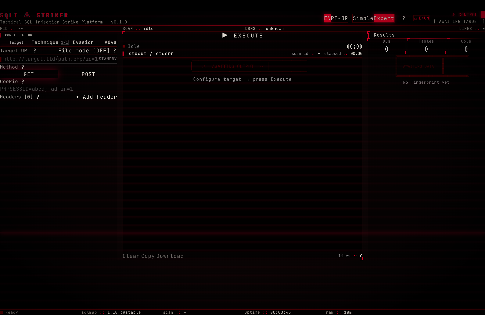
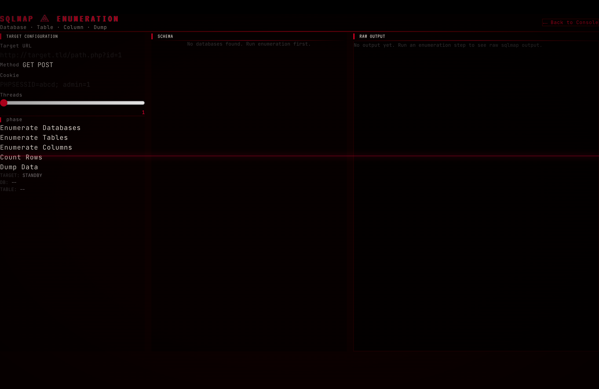

```
___  ___  _    ___      ___ _____ ___ ___ _  _____ ___ 
/ __|/ _ \| |  |_ _|    / __|_   _| _ \_ _| |/ / __| _ \
\__ \ (_) | |__ | |     \__ \ | | |   /| || ' <| _||   /
|___/\__\_\____|___|    |___/ |_| |_|_\___|_|\_\___|_|_\
```

# SQLI STRIKER ⟁

**Tactical web interface for sqlmap — the SQL injection strike platform.**

[](LICENSE)
[](https://nextjs.org)
[](https://react.dev)
[](CONTRIBUTING.md)

SQLI Striker is a cyberpunk-themed web dashboard that wraps [sqlmap](https://github.com/sqlmapproject/sqlmap), the industry-standard SQL injection tool. It spawns and controls sqlmap processes, streams output in real-time via SSE, parses results heuristically, and packs every sqlmap knob into a dual-mode UI — Simple for quick recon, Expert for surgical strikes.



---

## Why

sqlmap's CLI is powerful but typing `--technique=BEUST --level=5 --risk=3 --tamper=space2comment,charencode,randomcase --proxy=http://127.0.0.1:8080 --random-agent --delay=2 --threads=10` every time is tedious. SQLI Striker gives you a **weapon control panel** — flip toggles, slide risk/level, pick tampers from a searchable grid, hit EXECUTE, and watch the target fall apart in a real-time CRT terminal.

---

## Features

- **Dual UI modes** — Simple (target + preset → go) and Expert (tabbed full control panel)
- **5 scan presets** — STEALTH, STANDARD, AGGRESSIVE, WAF_BYPASS, BLIND_ONLY
- **6 SQLi techniques** — BEUSTQ: Boolean, Error, Union, Stacked, Time, Inline-Query
- **Level (1-5) and Risk (1-3)** sliders
- **Tamper picker** — search across 70+ tampers, one-click WAF bypass (7 common tampers)
- **Proxy egress** — Direct, Single, File List (rotation), Tor
- **Custom HTTP** — method, POST body, cookies, dynamic headers
- **Advanced tuning** — threads (capped 10), delay, timeout, retries, DBMS override, batch, flush session, form discovery, crawl depth, raw extra args
- **Real-time SSE streaming** — stdout/stderr line-by-line in a virtual CRT terminal
- **Heuristic parser** — auto-detects DBMS, web server, OS, technologies, databases, tables, columns from sqlmap output
- **Enumeration page** — post-exploit: enumerate DBs → tables → columns → dump
- **i18n** — EN / PT-BR (230+ keys), auto-detects browser language
- **Terminal aesthetic** — Matrix rain background, CRT scanlines, grain noise, glitch effects, blood-red palette
- **Accessible** — aria-live screen reader announcements, keyboard navigation
- **Secure by default** — sqlmap is spawned with a stripped environment, args validated against shell metachar injection, dangerous flags deny-listed (`--eval`, `--os-*`, `--file-*`, `-r`)

---

## Requirements

- **Node.js** 20+
- **sqlmap** installed and in your PATH
  - macOS: `brew install sqlmap`
  - Kali/Ubuntu: `sudo apt install sqlmap`
  - Or: `git clone --depth 1 https://github.com/sqlmapproject/sqlmap`

---

## Quick Start

```bash
git clone https://github.com/admmoises/sqli-striker
cd sqli-striker
npm install
```

### Configure sqlmap path (if not auto-detected)

Create `.env.local`:

```bash
# macOS Apple Silicon (default)
SQLMAP_BIN=/opt/homebrew/bin/sqlmap
SQLMAP_TAMPER_DIR=/opt/homebrew/Cellar/sqlmap/*/libexec/tamper

# Linux / Kali
# SQLMAP_BIN=/usr/bin/sqlmap
# SQLMAP_TAMPER_DIR=/usr/share/sqlmap/tamper
```

### Run

```bash
npm run dev
```

Open [http://localhost:3000](http://localhost:3000). The boot sequence will verify your sqlmap installation.

---

## Usage

### Simple Mode
1. Paste a target URL (e.g. `http://testphp.vulnweb.com/artists.php?artist=1`)
2. Pick a preset (Stealth, Standard, Aggressive, WAF Bypass, or Blind Only)
3. Hit **EXECUTE**

### Expert Mode
Flip the mode toggle to **Expert** to access four tabs:

| Tab | Controls |
|-----|----------|
| **Target** | URL, HTTP method, POST body, cookies, custom headers |
| **Technique** | Preset picker, BEUSTQ flags, Level/Risk sliders |
| **Evasion** | Tamper scripts (search + WAF bypass), proxy config, random User-Agent |
| **Advanced** | Threads, delay, timeout, retries, DBMS override, batch, flush session, form crawler, crawl depth, raw extra args |

### Enumeration
After a scan finds injectable parameters, click **ENUM** in the header to enter the enumeration pipeline:
1. Enumerate databases
2. Select a database → enumerate tables
3. Select a table → enumerate columns
4. Select columns → dump data



---

## Security

This tool spawns sqlmap as a child process. To prevent abuse:

- **Deny-list** blocks dangerous flags: `--eval`, `--os-shell`, `--os-pwn`, `--os-cmd`, `--file-read`, `--file-write`, `--file-dest`, `-r`, `--load-cookies`
- **Shell metachar filtering** on all user inputs before they reach spawn
- **Stripped child environment** — only PATH, HOME, LANG, LC_ALL, TMPDIR, TERM are passed through
- **Threads capped at 10** in the UI
- **Batch mode forced** to prevent sqlmap from hanging on interactive prompts

See [SECURITY.md](SECURITY.md) for the full policy.

---

## Tech Stack

| Layer | Technology |
|-------|-----------|
| Framework | Next.js 16.2 (App Router) |
| UI | React 19.2, TypeScript 5 |
| Styling | Tailwind CSS v4, CSS custom properties |
| Animation | Framer Motion |
| Icons | Lucide React |
| Toasts | Sonner |
| SQL scanner | sqlmap (spawned as child process) |
| Streaming | SSE via ReadableStream + fetch |

---

## Project Structure

```
.
├── app/
│   ├── page.tsx                  # Main console (shell → ControlPanel)
│   ├── layout.tsx                # Root layout (MatrixRain, overlays, Toaster)
│   ├── globals.css               # Design system (colors, fonts, keyframes, utilities)
│   ├── enum/page.tsx             # Post-exploit enumeration page
│   └── api/sqlmap/
│       ├── check/route.ts        # GET: sqlmap binary health check
│       ├── scan/route.ts         # POST: spawn sqlmap, stream SSE
│       ├── stop/route.ts         # POST: SIGTERM → SIGKILL
│       ├── enum/route.ts         # POST: enumeration commands
│       └── tampers/route.ts      # GET: list available tamper scripts
├── components/
│   ├── ControlPanel.tsx          # Main orchestrator (628 lines)
│   ├── OutputStream.tsx          # Virtual CRT terminal (SSE consumer)
│   ├── ResultsPanel.tsx          # Heuristic fingerprint / enumeration display
│   ├── ExpertTabs.tsx            # Target / Technique / Evasion / Advanced tabs
│   ├── TargetInput.tsx           # URL input + file mode toggle
│   ├── MethodPanel.tsx           # HTTP method, POST body, cookies, headers
│   ├── TechniqueSelector.tsx     # BEUSTQ technique flags
│   ├── LevelRiskSliders.tsx      # Level (1-5) and Risk (1-3) controls
│   ├── TamperPicker.tsx          # Tamper search with WAF bypass
│   ├── PresetPicker.tsx          # 5 scan presets
│   ├── ProxyConfig.tsx           # Direct / Single / List / Tor
│   ├── AdvancedPanel.tsx         # Threads, delay, timeout, retries, DBMS, etc.
│   ├── ControlBar.tsx            # EXECUTE / ABORT with timer
│   ├── StatusFooter.tsx          # sqlmap status, uptime, RAM
│   ├── BootSequence.tsx          # Terminal boot animation
│   ├── EnumAssistant.tsx         # Post-exploit enumeration workflow
│   ├── MatrixRain.tsx            # Digital rain background effect
│   ├── ScanlinesOverlay.tsx      # CRT scanline overlay
│   ├── GrainOverlay.tsx          # Noise grain overlay
│   ├── HelpDrawer.tsx            # Help panel with keyboard shortcuts
│   └── HelpIcon.tsx              # "?" button
└── lib/
    ├── sqlmap-config.ts          # Binary path resolution (env overridable)
    ├── sqlmap-args.ts            # CLI argument builder + validation + deny-list
    ├── scan-manager.ts           # Global process registry (HMR-safe)
    ├── scan-config.ts            # ScanConfig types, presets, payload builder
    ├── parse-results.ts          # Heuristic stdout → fingerprint/DB/table parser
    ├── use-scan.ts               # SSE hook (fetch ReadableStream + manual SSE parser)
    ├── i18n.ts                   # EN/PT-BR dictionary (230+ keys)
    └── utils.ts                  # cn() classname merger
```

---

## Contributing

PRs welcome. See [CONTRIBUTING.md](CONTRIBUTING.md) for setup, conventions, and checklist.

---

## License

MIT — use it, hack it, ship it. Just don't point it at targets you don't own.

---

## Disclaimer

SQLI Striker is an offensive security tool. You are responsible for complying with all applicable laws. Only test systems you own or have explicit permission to test. The authors assume no liability for misuse.
